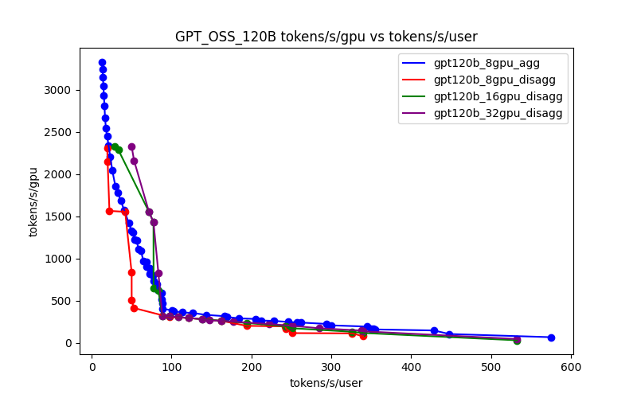

# Generating the pareto frontier plot for an experiment

This repo: https://github.com/ai-dynamo/aiconfigurator covers setup

Example run:
```
aiconfigurator cli exp --yaml_path aic-sweep.yaml --save_dir aic-sweep
```

results:


For the sweep:
[yaml](./aic-sweep.yaml)
